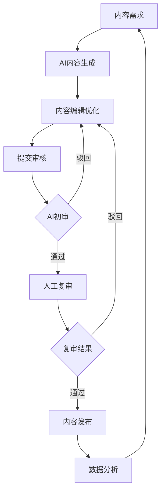

# 政务新媒体AI内容工厂 - 产品需求文档

## 1. 产品概述

政务新媒体AI内容工厂是为政府部门打造的智能化内容创作平台，通过AI技术实现政务内容的自动化生成、智能编辑、合规审核和数据分析。系统旨在提升政务新媒体内容生产效率，确保内容质量和合规性，助力政府更好地进行政策传播和民生服务。

目标用户包括各级政府部门的新媒体运营人员、宣传部门工作人员、政策解读专员等，帮助他们快速生成高质量的政务内容，提升政务传播效果。

## 2. 核心功能

### 2.1 用户角色

| 角色 | 注册方式 | 核心权限 |
|------|---------|----------|
| 内容编辑 | 管理员分配账号 | 内容生成、编辑、提交审核 |
| 内容审核员 | 管理员分配账号 | 内容审核、反馈修改意见 |
| 发布专员 | 管理员分配账号 | 审核通过内容发布 |
| 系统管理员 | 初始超级管理员 | 用户管理、权限配置、系统设置 |

### 2.2 功能模块

政务新媒体AI内容工厂包含以下核心功能模块：

1. **内容生成中心**: AI智能生成、模板选择、风格控制
2. **智能编辑工作台**: 内容编辑、智能排版、多平台适配
3. **内容审核系统**: 敏感词检测、政策一致性检查、审核流程管理
4. **数据分析平台**: 舆情监测、热点分析、选题推荐
5. **内容资产管理**: 内容归档、智能检索、版权管理
6. **系统管理中心**: 用户权限、操作日志、配置管理

### 2.3 页面详情

| 页面名称 | 模块名称 | 功能描述 |
|---------|---------|----------|
| 首页 | 系统概览 | 显示内容生产统计、待办事项、快捷入口 |
| 首页 | 最近项目 | 展示最近编辑的内容项目，支持快速继续编辑 |
| 首页 | 系统公告 | 显示重要通知和政策更新信息 |
| 内容生成 | AI文本生成 | 输入关键词生成政策解读、通知公告等文本内容 |
| 内容生成 | AI图像生成 | 根据描述生成政务海报、数据图表等视觉内容 |
| 内容生成 | 模板库 | 提供各类政务内容模板，支持自定义模板 |
| 内容生成 | 风格控制 | 选择权威/亲民/科普/宣传等不同风格语气 |
| 内容编辑 | 富文本编辑器 | 提供完整的文本编辑功能，支持插入图片视频 |
| 内容编辑 | 智能排版 | 自动优化段落结构、标题层级、图文混排 |
| 内容编辑 | 平台适配 | 一键适配微信、微博、抖音等不同平台格式 |
| 内容编辑 | 预览功能 | 实时预览不同平台的显示效果 |
| 内容审核 | 待审核列表 | 显示待审核内容，支持批量审核操作 |
| 内容审核 | 审核详情 | 展示内容详情，提供审核意见输入 |
| 内容审核 | 敏感词检测 | 自动检测并标记敏感词汇 |
| 内容审核 | 政策比对 | 与官方政策表述进行一致性检查 |
| 数据分析 | 舆情监测 | 实时监测各平台政务相关话题热度 |
| 数据分析 | 热点榜单 | 展示当前热门政务话题和关键词 |
| 数据分析 | 选题推荐 | 基于数据分析推荐内容创作方向 |
| 数据分析 | 传播效果 | 分析已发布内容的传播数据和用户反馈 |
| 资产管理 | 内容库 | 展示所有已创建内容的列表和状态 |
| 资产管理 | 智能搜索 | 支持关键词、标签、时间等多维度搜索 |
| 资产管理 | 分类管理 | 按主题、部门、时间等维度分类管理内容 |
| 系统管理 | 用户列表 | 管理系统用户，支持添加、编辑、删除 |
| 系统管理 | 权限配置 | 设置不同角色的功能权限和数据权限 |
| 系统管理 | 操作日志 | 记录所有用户的重要操作行为 |
| 系统管理 | 系统设置 | 配置系统参数、审核规则、通知设置 |

## 3. 核心流程

### 3.1 内容生产流程

### 3.2 用户操作流程

**内容编辑人员流程**:
1. 登录系统进入工作台
2. 选择内容类型和生成方式
3. 使用AI生成或手动创建内容
4. 编辑和优化内容
5. 提交审核
6. 根据审核意见修改
7. 审核通过后发布

**审核人员流程**:
1. 查看待审核内容列表
2. 详细审查内容合规性
3. 使用AI辅助检测工具
4. 给出审核意见
5. 对驳回内容提供修改建议

## 4. 用户界面设计

### 4.1 设计规范

**色彩体系**:
- 主色调: #1E40AF (政务蓝，体现权威性)
- 辅助色: #3B82F6 (交互蓝，用于按钮和链接)
- 成功色: #10B981 (绿色，表示通过和成功)
- 警告色: #F59E0B (橙色，表示待处理和警告)
- 错误色: #EF4444 (红色，表示错误和驳回)

**字体规范**:
- 标题: 18-24px，思源黑体，加粗
- 正文: 14-16px，微软雅黑，常规
- 辅助文字: 12-14px，灰色，常规

**布局风格**:
- 左侧导航栏 + 右侧内容区的经典布局
- 卡片式设计，信息层次清晰
- 响应式设计，支持不同屏幕尺寸
- 统一的间距和圆角规范

### 4.2 页面设计详述

| 页面名称 | 模块名称 | UI元素 |
|---------|---------|---------|
| 首页 | 顶部导航 | 系统logo、用户信息、通知图标、退出按钮 |
| 首页 | 统计卡片 | 内容总数、待审核数、发布成功数，使用大号数字和图标 |
| 首页 | 快捷操作 | 大按钮设计，包含图标和文字，支持快速创建内容 |
| 内容生成 | 输入区域 | 清晰的分组输入框，支持关键词和文件上传 |
| 内容生成 | 生成结果 | 卡片式展示生成结果，支持编辑和保存 |
| 内容编辑 | 编辑器 | 类似Word的编辑界面，工具栏置顶，支持富文本编辑 |
| 内容编辑 | 侧边栏 | 右侧显示属性设置、历史版本、协作者等信息 |
| 内容审核 | 审核面板 | 左侧内容预览，右侧审核操作区域 |
| 数据分析 | 图表区域 | 使用ECharts展示各类数据图表 |
| 数据分析 | 数据表格 | 清晰的表格展示详细数据，支持排序和筛选 |

### 4.3 响应式设计

**桌面端 (>1200px)**:
- 完整展示所有功能和信息
- 左侧固定导航栏，右侧内容区域
- 多列布局展示列表和卡片

**平板端 (768px-1200px)**:
- 导航栏可收起，释放更多内容空间
- 适当调整列数和卡片大小
- 保持核心功能完整可用

**移动端 (<768px)**:
- 底部导航栏替代侧边导航
- 单列布局，垂直堆叠
- 简化操作流程，突出核心功能

## 5. 技术实现要求

### 5.1 性能要求
- 页面加载时间 < 3秒
- AI生成响应时间 < 10秒
- 支持1000+用户并发访问
- 数据查询响应时间 < 1秒

### 5.2 安全要求
- 所有数据传输使用HTTPS加密
- 用户密码加密存储
- 实现完整的权限控制
- 定期安全漏洞扫描

### 5.3 可用性要求
- 系统可用性 > 99.9%
- 支持7×24小时运行
- 自动备份和灾难恢复
- 用户操作有明确反馈

## 6. 项目约束

### 6.1 时间约束
- 总开发周期: 5周
- 第一阶段: 2周 (基础框架和核心功能)
- 第二阶段: 2周 (完整功能实现)
- 第三阶段: 1周 (测试优化和部署)

### 6.2 资源约束
- 开发团队: 3-5人
- 服务器资源: 云服务器部署
- AI服务: 使用第三方API (OpenAI、百度AI等)
- 预算限制: 控制在合理范围内

### 6.3 合规约束
- 符合政务信息系统安全等级保护要求
- 内容生成符合政府信息发布规范
- 用户隐私保护符合相关法律法规
- 系统操作有完整的审计日志