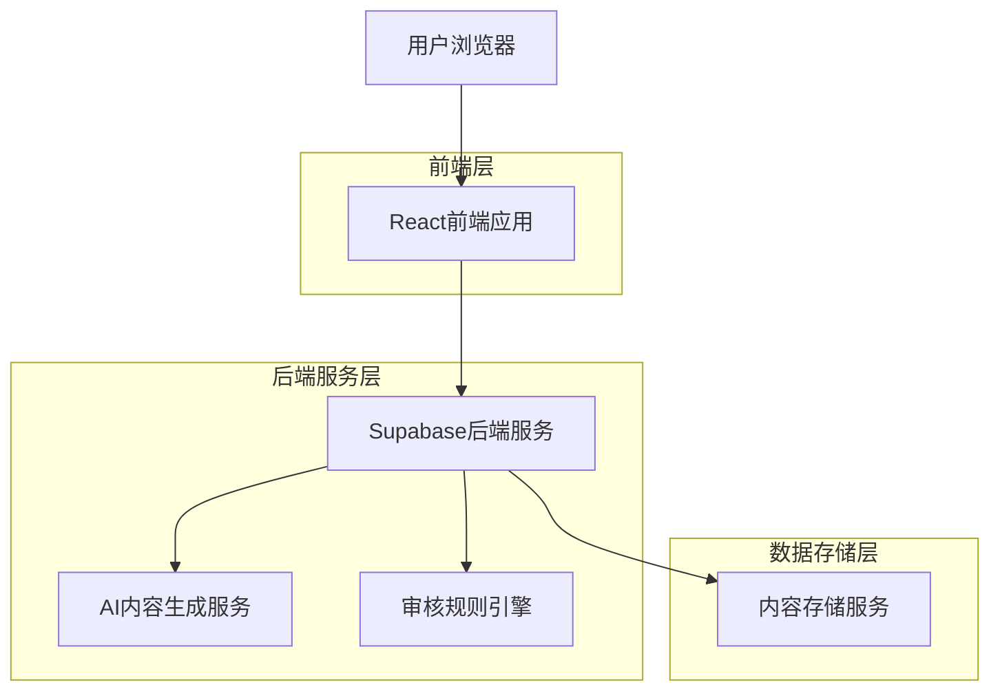
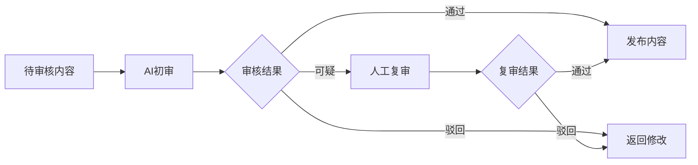
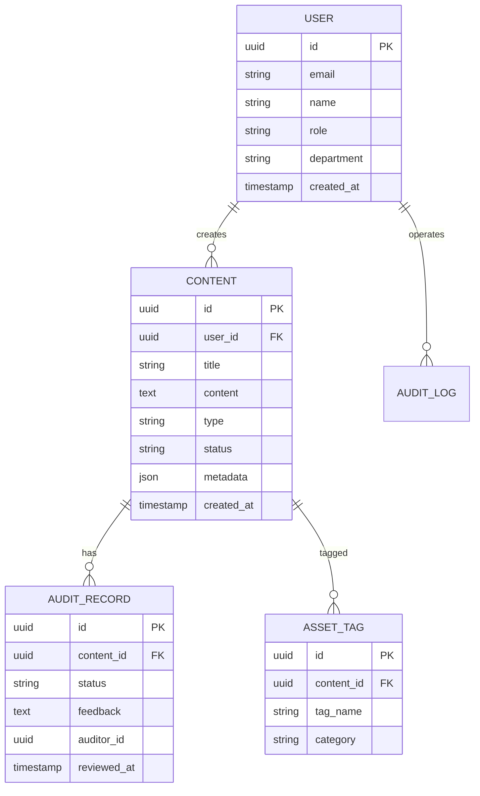

# 政务新媒体AI内容工厂 - 技术架构文档

## 1. 项目概述

政务新媒体AI内容工厂是一个集成了人工智能技术的政务内容创作平台，旨在为政府部门提供智能化、高效化的内容生成、编辑、审核和管理服务。系统通过AI大模型实现文本、图像、视频等多媒体内容的自动生成，同时提供内容审核、数据分析、资产管理等完整的内容生产链路。

## 2. 技术架构设计

### 2.1 系统架构图



### 2.2 技术栈选择

- **前端框架**: React 18 + TypeScript
- **UI组件库**: Ant Design 5.x
- **样式方案**: Tailwind CSS 3.x
- **状态管理**: React Context + useReducer
- **构建工具**: Vite
- **后端服务**: Supabase (认证+数据库+存储)
- **AI集成**: OpenAI API (文本生成) + Stable Diffusion (图像生成)

### 2.3 前端路由设计

| 路由路径 | 页面名称 | 功能描述 |
|---------|---------|---------|
| / | 首页 | 系统概览和快捷入口 |
| /content-generate | 内容生成 | AI内容生成工作台 |
| /content-edit | 内容编辑 | 智能编辑和排版工具 |
| /content-audit | 内容审核 | 合规性检查和审核流程 |
| /data-analysis | 数据分析 | 舆情监测和选题推荐 |
| /asset-management | 资产管理 | 内容归档和检索 |
| /user-management | 用户管理 | 权限管理和操作日志 |

## 3. 核心功能模块设计

### 3.1 内容生成模块

**技术实现**:
- 集成OpenAI GPT模型进行文本生成
- 使用Stable Diffusion API进行图像生成
- 实现多风格模板系统（权威/亲民/科普/宣传）
- 支持多语言输出（中文/英文/藏文/维吾尔文）

**前端组件**:
```typescript
interface ContentGenerateProps {
  contentType: 'text' | 'image' | 'video';
  style: 'authoritative' | 'friendly' | 'educational' | 'promotional';
  language: 'zh' | 'en' | 'bo' | 'ug';
}
```

### 3.2 内容编辑模块

**核心功能**:
- 富文本编辑器集成（基于Quill.js）
- 智能排版算法自动优化内容结构
- 多平台格式适配（微信/微博/抖音/政务APP）
- 实时预览和响应式布局

### 3.3 内容审核模块

**审核流程**:


**技术实现**:
- 敏感词库动态更新机制
- 政策表述一致性比对算法
- 图像内容安全检测API集成
- 审核日志完整记录和追溯

### 3.4 数据分析模块

**数据源集成**:
- 微博热搜API接入
- 百度指数数据抓取
- 微信指数趋势分析
- 政务平台用户行为数据

**分析算法**:
- 热点话题聚类分析
- 用户画像构建算法
- 内容传播效果预测模型
- 选题推荐引擎

## 4. 数据模型设计

### 4.1 核心数据表结构



### 4.2 Supabase表定义

```sql
-- 用户表
CREATE TABLE users (
    id UUID PRIMARY KEY DEFAULT gen_random_uuid(),
    email VARCHAR(255) UNIQUE NOT NULL,
    name VARCHAR(100) NOT NULL,
    role VARCHAR(50) DEFAULT 'editor',
    department VARCHAR(100),
    created_at TIMESTAMP WITH TIME ZONE DEFAULT NOW()
);

-- 内容表
CREATE TABLE contents (
    id UUID PRIMARY KEY DEFAULT gen_random_uuid(),
    user_id UUID REFERENCES users(id),
    title VARCHAR(255) NOT NULL,
    content TEXT,
    type VARCHAR(50) NOT NULL, -- text, image, video
    status VARCHAR(50) DEFAULT 'draft', -- draft, pending, approved, rejected
    metadata JSONB,
    created_at TIMESTAMP WITH TIME ZONE DEFAULT NOW(),
    updated_at TIMESTAMP WITH TIME ZONE DEFAULT NOW()
);

-- 审核记录表
CREATE TABLE audit_records (
    id UUID PRIMARY KEY DEFAULT gen_random_uuid(),
    content_id UUID REFERENCES contents(id),
    status VARCHAR(50) NOT NULL,
    feedback TEXT,
    auditor_id UUID REFERENCES users(id),
    reviewed_at TIMESTAMP WITH TIME ZONE DEFAULT NOW()
);

-- 创建索引
CREATE INDEX idx_contents_user_id ON contents(user_id);
CREATE INDEX idx_contents_status ON contents(status);
CREATE INDEX idx_contents_created_at ON contents(created_at DESC);
CREATE INDEX idx_audit_records_content_id ON audit_records(content_id);
```

## 5. 界面设计规范

### 5.1 设计原则
- **政务风格**: 简洁大气，体现权威性
- **用户友好**: 操作直观，降低学习成本
- **响应式设计**: 适配不同设备尺寸
- **无障碍访问**: 支持键盘导航和屏幕阅读器

### 5.2 色彩方案
- **主色调**: #1E40AF (深蓝，体现权威性)
- **辅助色**: #3B82F6 (亮蓝，用于交互元素)
- **成功色**: #10B981 (绿色，表示通过/成功)
- **警告色**: #F59E0B (橙色，表示待审核)
- **错误色**: #EF4444 (红色，表示驳回/错误)

### 5.3 组件规范
- 使用Ant Design组件库保持一致性
- 自定义政务主题样式
- 统一的表单验证规则
- 标准化的错误处理和提示

## 6. 安全与合规

### 6.1 数据安全
- 所有数据传输使用HTTPS加密
- 敏感数据在数据库中加密存储
- 实现完整的操作日志记录
- 定期数据备份和恢复机制

### 6.2 内容合规
- 内置政务内容发布规范
- 敏感信息自动检测和过滤
- 多级审核机制确保内容质量
- 与国家相关政策保持同步更新

### 6.3 权限管理
- 基于角色的访问控制(RBAC)
- 支持单点登录(SSO)集成
- 细粒度的功能权限控制
- 定期权限审计和清理

## 7. 性能优化

### 7.1 前端优化
- 组件懒加载减少首屏加载时间
- 图片压缩和CDN加速
- 虚拟滚动处理大量数据展示
- 前端缓存策略优化

### 7.2 后端优化
- 数据库查询优化和索引设计
- API响应数据压缩
- 静态资源缓存策略
- 并发处理优化

## 8. 部署方案

### 8.1 开发环境
```bash
# 项目初始化
npm create vite@latest gov-ai-content-factory --template react-ts
cd gov-ai-content-factory
npm install antd tailwindcss @supabase/supabase-js

# Supabase本地开发
npm install -g supabase
supabase init
supabase start
```

### 8.2 生产部署
- 前端: Vercel/Netlify自动部署
- 后端: Supabase云服务
- CDN: 阿里云CDN加速
- 监控: 接入应用性能监控(APM)

## 9. 开发计划

### 第一阶段 (2周)
- [ ] 基础框架搭建和路由配置
- [ ] Supabase集成和用户认证
- [ ] 内容生成模块核心功能
- [ ] 基础UI组件开发

### 第二阶段 (2周)
- [ ] 内容编辑和排版功能
- [ ] 内容审核流程实现
- [ ] 数据分析和可视化
- [ ] 资产管理功能

### 第三阶段 (1周)
- [ ] 权限管理系统
- [ ] 系统测试和优化
- [ ] 文档完善和部署
- [ ] Demo演示准备

## 10. 风险评估与应对

### 技术风险
- **AI模型稳定性**: 准备备用API服务商
- **数据安全**: 加强加密和访问控制
- **性能瓶颈**: 提前进行压力测试和优化

### 业务风险
- **政策变化**: 建立政策更新响应机制
- **用户接受度**: 提供充分的培训和支持
- **内容质量**: 建立完善的审核和质量控制体系